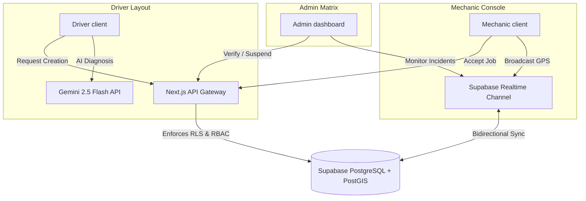

# RoadRescue — Final MVP 1 Technical Briefcase
> **Academic Defense & NotebookLM Reference Guide**  
> *Author:* Lead Database Architect & Senior Supabase Engineer  
> *Target:* Academic Examination Panel & FYP Evaluation Board  

---

## 1. System Abstract

RoadRescue is an intelligent, full-stack roadside emergency coordination platform engineered to eliminate the fragmentation, delays, and security vulnerabilities inherent in traditional vehicle breakdown response systems. By combining dynamic geospatial intelligence, decoupled real-time synchronization, and AI-driven diagnostic analysis, the platform establishes a seamless, low-latency bridge between stranded drivers, verified mechanics, and administrative supervisors. The system reduces emergency dispatch matching windows from minutes to seconds, providing stranded drivers with instant clarity, real-time visual progress, and authenticated support.

At its core, RoadRescue introduces two key technical innovations: **Decoupled Real-Time Coordination** and **PostGIS Spatial Matching**. By separating the request-creation pipeline from matched dispatch alerts via asynchronous background tasks, the system guarantees instant HTTP responses to drivers while executing complex spatial calculations in the background. Geolocation processing leverages the PostGIS spatial extension to run high-efficiency, index-accelerated radial queries (`ST_DWithin` and `ST_Distance`) over active mechanic coordinates. This allows the system to identify, notify, and dispatch the closest online, verified specialists.

The direct result is a highly responsive, resilient system capable of handling stressful breakdown scenarios. From initial diagnostic text translation powered by Google Gemini 2.5 Flash to automated transactional status notifications via Resend and real-time WebSocket state synchronizations via Supabase Realtime, RoadRescue ensures continuous feedback loops. The system maintains strict operational transparency and complete data integrity through database-enforced Row-Level Security (RLS) and serverless route authorization layers.

---

## 2. Component Architecture & Interactions

The system is structured as three distinct operational components interacting securely over a unified database core:



*   **Client System (Driver Layout):** Stranded users can log in, run AI vehicle diagnostics, select coordinates using an interactive Leaflet map picker, and submit rescue orders. It receives instant status updates, coordinates assigned mechanics via live map tracking, and reviews mechanics upon completion.
*   **Field Service (Mechanic Console):** Verified mechanics toggle their online status, causing custom hooks to broadcast their GPS coordinates via Supabase Realtime WebSockets. They view nearby breakdown pins, accept matching requests, receive driver detail cards, and update status timelines (`en_route` -> `arrived` -> `in_progress` -> `completed`).
*   **Operations Command (Admin Matrix):** Administrators oversee the entire ecosystem. They monitor active requests, review change requests, approve or reject mechanic verification logs, delete auth users (applying cascade cleanup for violations), and access consolidated platform statistics.

---

## 3. Third-Party Ecosystem Integration

RoadRescue operates via four specialized external service integrations:

### A. Supabase (Core Backend-as-a-Service)
*   **PostgreSQL Storage Engine:** Acts as the primary transactional storage, using relational schemas to enforce integrity constraints (e.g. cascading profile deletions).
*   **PostGIS Extension:** Powers geographic queries on coordinates stored as `GEOGRAPHY(Point, 4326)`. It handles indexing via GIST and measures distances via `ST_Distance`.
*   **Auth & Triggers:** Manages user registration, login, and session tokens. Database triggers hook into `auth.users` to automatically create role-specific sub-profiles on signup.
*   **Realtime WebSockets:** Pushes database mutations (inserts, updates) to active clients via dynamic channel subscriptions (`rescue_requests`, `messages`, `notifications`).

### B. Google Gemini 2.5 Flash (AI Diagnostic Engine)
*   **System Fault Translation:** Converts natural language breakdown descriptions (e.g., *"white smoke from hood, hiss sound"*) into structured JSON objects.
*   **Data Validation:** Employs a strict JSON response schema mapping the issue category, severity level (`low`, `medium`, `high`, `critical`), estimated causes, and safety recommendations.
*   **Backend Resilience & Fallback Labeling:** Wrapped in an API route with per-user sliding-window rate limiting (20 requests/min keyed by authenticated `user:${id}` with IP fallback) and exponential backoff retry logic. When degraded or offline, deterministic keyword-matching fallback rules classify symptoms across 7 automotive domains and explicitly label the output in the UI as basic offline guidance.
*   **Mobile Network Context (CGNAT Limitation):** In the Ghanaian telecommunications landscape (e.g., MTN, Telecel, AT), mobile carriers deploy Carrier-Grade NAT (CGNAT) where thousands of mobile subscribers share a single public IP. Keying rate limits by IP address results in severe false-positive throttling collisions across unrelated users. RoadRescue resolves this by authenticating sessions and isolating quotas strictly per user ID.

### C. Resend (Email Infrastructure)
*   **Transactional Notifications:** Sends automated emails to drivers and mechanics when requests are created, accepted, or cancelled.
*   **Decoupled Send:** Dispatched as non-blocking fire-and-forget promises in API handlers, ensuring that any email delays do not affect the client’s request lifecycle.

### D. Alternative Commute Gateway
*   **Evacuation Routing:** Provides stranded drivers with hardcoded redirect links to third-party ride-hailing services (Bolt, Yango, Uber) in the UI, enabling instant scene evacuation if the vehicle cannot be repaired immediately.

---

## 4. System Architecture & File Map

Below is the complete file tree mapping of the RoadRescue codebase:

```text
roadrescue/
├── docs/                               # System architecture and API documentation
│   ├── ai-diagnostic.md                # Explains Gemini JSON schema and AI validation flows
│   ├── api-reference.md                # Documents all public Next.js API endpoints and methods
│   ├── architecture.md                 # Explains component relationships and three-tier stack
│   ├── db-schema.md                    # Visualizes the entity relationship diagrams and fields
│   ├── DEVELOPER_NOTES.md              # Scratch developer setup and environment configuration
│   ├── realtime-flow.md                # Traces Supabase realtime channel events and broadcast hooks
│   ├── rls-policies.md                 # Summarizes all security policies applied on tables
│   └── state-machine.md                # Formally documents the request lifecycle transitions
│
├── supabase/                           # Database schema and migrations
│   └── migrations/                     # Sequential SQL scripts defining database layers
│       ├── 0001_extensions_and_types.sql # Initializes PostGIS, pgcrypto, and global ENUM values
│       ├── 0002_user_and_mechanic_profiles.sql # Sets up profile tables and the auth signup trigger
│       ├── 0003_rescue_requests_schema.sql # Creates rescue requests schema with geography point fields
│       ├── 0004_tracking_and_history.sql # Defines tracking, history, preferences, and notifications
│       ├── 0005_stored_procedures.sql # Implements get_nearby_verified_mechanics stored procedure
│       └── 0006_security_and_rls_policies.sql # Applies row-level security policies to all 18 tables
│
└── web/                                # Next.js web application root
    ├── src/                            # Code files
    │   ├── app/                        # Next.js App Router route segments and pages
    │   │   ├── api/                    # Server-side Next.js API endpoints
    │   │   │   ├── admin/              # Administrative route guards
    │   │   │   │   ├── escalate/       # Grants admin privileges to profile rows
    │   │   │   │   ├── mechanics/      # Verification workflows and email blocklist logging
    │   │   │   │   ├── profile-change-requests/ # Resolves profile change requests
    │   │   │   │   └── users/          # Administration CRUD and account suspensions
    │   │   │   ├── auth/               # Auth cookie sessions and token setups
    │   │   │   ├── notifications/      # Notifications API handlers
    │   │   │   │   └── email/          # Dispatches transactional emails via Resend SDK
    │   │   │   ├── profile/            # User-profile management routes
    │   │   │   │   ├── change-requests/# Files change requests for driver/mechanic accounts
    │   │   │   │   └── preferences/    # Handles UI theme and communication settings
    │   │   │   ├── reports/            # Audits system incident reports
    │   │   │   ├── requests/           # Handles rescue requests operations
    │   │   │   │   ├── [id]/           # Dynamic request segment
    │   │   │   │   │   ├── messages/   # Scopes chat messages to a specific request
    │   │   │   │   │   ├── rate/       # Submits ratings and reviews for completed requests
    │   │   │   │   │   ├── route.js    # Retrieves single request details securely
    │   │   │   │   │   └── status/     # Enforces status transitions and cancellation checks
    │   │   │   │   ├── route.js        # Handles request creation and realtime broadcasting
    │   │   │   │   ├── status/         # Updates status logs
    │   │   │   │   └── track/          # Tracks active mechanic coordinates
    │   │   │   └── search/             # Executes keyword searches across requests and profiles
    │   │   ├── auth/                   # Public authentication pages
    │   │   │   ├── login/              # Renders login forms
    │   │   │   └── register/           # Renders signup tab controls
    │   │   ├── dashboard/              # Protected dashboards routes
    │   │   │   ├── admin/              # Operations command matrix
    │   │   │   │   ├── account/        # Admin profile settings
    │   │   │   │   ├── mechanics/      # Pending mechanic approval grids
    │   │   │   │   ├── requests/       # Administrative request monitors
    │   │   │   │   │   ├── [id]/       # Detailed request audit page
    │   │   │   │   │   └── page.jsx    # Displays request list
    │   │   │   │   ├── users/          # Manage accounts and user roles
    │   │   │   │   └── page.jsx        # Admin stats breakdown dashboard
    │   │   │   ├── driver/             # Client layout dashboard
    │   │   │   │   ├── account/        # Driver profile and vehicle settings
    │   │   │   │   ├── history/        # Historical request list
    │   │   │   │   ├── request/        # Driver request creation and status tracking
    │   │   │   │   │   ├── [id]/       # Live tracking page
    │   │   │   │   │   │   ├── rating/ # Rating page
    │   │   │   │   │   │   └── page.jsx # Request status details
    │   │   │   │   │   └── new/        # Creates new rescue requests
    │   │   │   │   └── page.jsx        # Driver main actions layout
    │   │   │   └── mechanic/           # Field service dashboard
    │   │   │       ├── account/        # Mechanic availability, specials, and rates settings
    │   │   │       ├── history/        # Completed job history logs
    │   │   │       ├── job/            # Mechanic active jobs
    │   │   │       │   └── [id]/       # Dynamic job tracking and navigator
    │   │   │       │       ├── complete/ # Form to complete jobs
    │   │   │       │       └── page.jsx # Job actions screen
    │   │   │       ├── navigation/     # Radar mode and directions map
    │   │   │       ├── requests/       # Displays pending matching requests
    │   │   │       └── page.jsx        # Mechanic landing panel
    │   │   ├── layout.jsx              # Global styling root layout wrapper
    │   │   └── page.jsx                # Public landing page with role routing
    │   ├── components/                 # Reusable React components
    │   │   ├── admin/                  # Admin UI components
    │   │   │   └── LiveHotspotsMap.jsx # Interactive Leaflet map for live coordinates monitoring
    │   │   ├── ai/                     # AI diagnostic components
    │   │   │   └── DiagnosticChat.jsx  # Conversational interface for LLM symptom analysis
    │   │   ├── auth/                   # Login and registration inputs
    │   │   │   ├── LoginForm.jsx       # Processes user login credentials
    │   │   │   └── RegisterForm.jsx    # Processes signups and saves role profiles
    │   │   ├── map/                    # Mapping components
    │   │   │   ├── LocationPicker.jsx  # Location selection map showing fuel/EV stations
    │   │   │   └── RescueMap.jsx       # Driver/mechanic route tracking leaflet map
    │   │   ├── request/                # Request state components
    │   │   │   ├── RequestForm.jsx     # Handles request creation step cards
    │   │   │   └── RequestTracker.jsx  # Status progress trackers
    │   │   └── ui/                     # UI components
    │   ├── hooks/                      # Custom hooks
    │   │   ├── useAuth.js              # Wraps auth profiles and session state
    │   │   ├── useIncomingJobs.js      # Listens to new requests via WebSockets
    │   │   ├── useMechanicLocation.js  # Tracks assigned mechanic location
    │   │   ├── useMechanicStatus.js    # Manages status toggles and GPS broadcasts
    │   │   ├── useNotifications.js     # Synchronizes in-app notifications
    │   │   ├── useRealtime.js          # Subscribes to custom Supabase realtime channels
    │   │   ├── useRequest.js           # Handles single request operations
    │   │   └── useRequestStatus.js     # Encapsulates request state transitions
    │   ├── lib/                        # Business logic utility helpers
    │   │   ├── admin.js                # Administration DB queries and updates
    │   │   ├── auth.js                 # Authentication logic and signups
    │   │   ├── constants.js            # App-wide roles, statuses, and enums
    │   │   ├── email.js                # Renders templates and dispatches email via Resend
    │   │   ├── rateLimit.js            # Limits API requests
    │   │   ├── rbac.js                 # Enforces route-level role authorization
    │   │   ├── request.js              # Creates requests, updates status, and rates mechanics
    │   │   ├── rescueLifecycle.js      # Normalizes status states
    │   │   ├── supabase/               # Supabase configuration
    │   │   │   ├── client.js           # Client-side Supabase connection
    │   │   │   └── server.js           # Server-side client generator
    │   │   ├── utils.js                # Formatting helpers
    │   │   └── validate.js             # Validates API payloads
    │   ├── providers/                  # Context providers
    │   │   └── AuthProvider.jsx        # Renders session scopes and syncs auth changes
    │   └── styles/                     # Tailwind styling sheets
    └── package.json                    # Package manifest file
```

---

## 5. Defense & Presentation Preparation (Viva Kit)

Use these questions and answers to prepare for your final project defense:

### Question 1: How does your PostGIS spatial query handle mechanic matching, and how is it optimized to prevent performance degradation as the database grows?
*   **Articulate Answer:** Mechanic matching is handled via the PostgreSQL stored procedure `get_nearby_verified_mechanics`. It calculates distance dynamically between the breakdown's coordinates and the mechanic's location using PostGIS spatial operators:
    ```sql
    ST_DWithin(mp.current_location::geography, ST_SetSRID(ST_MakePoint(request_longitude, request_latitude), 4326)::geography, search_radius_km * 1000)
    ```
    To optimize this query as the database grows, we created a spatial index on `mechanic_profiles` using the **GIST (Generalized Search Tree)** index method:
    ```sql
    CREATE INDEX idx_mechanic_geo ON public.mechanic_profiles USING gist(current_location);
    ```
    This indexes the bounding boxes of the points. Instead of executing an expensive $O(N)$ sequential scan recalculating coordinates for every mechanic, the database uses index-accelerated bounding box filtering, reducing complexity to $O(\log N)$ for near-instant matches.

### Question 2: In Next.js 16, dynamic route segments (like `/dashboard/driver/request/[id]`) receive page parameters asynchronously. How does your codebase handle this without causing runtime hydration errors?
*   **Articulate Answer:** In Next.js 16, route parameters (such as `params`) are handled asynchronously. If a React component references `params.id` synchronously during server rendering, it throws a runtime hydration error because the value is not resolved at that stage. We address this by wrapping the parameters in React's `use` hook to resolve the promise before accessing its attributes:
    ```javascript
    import { use } from 'react';
    
    export default function RequestDetailsPage({ params }) {
      const resolvedParams = use(params);
      const requestId = resolvedParams.id;
      // ... safe to render or pass to fetching hooks
    }
    ```
    This ensures clean async resolution and prevents hydration mismatches.

### Question 3: Explain your Row-Level Security (RLS) configuration. How do you prevent a malicious driver from reading coordinates or intercepted messages from unrelated rescue operations?
*   **Articulate Answer:** Row-Level Security (RLS) is enabled on all tables and checked at the database level. For sensitive tables like `mechanic_locations`, `messages`, and `rescue_requests`, we apply RLS using policies based on `auth.uid()`:
    *   **Locations:** Only the assigned driver can query their mechanic's location:
        ```sql
        CREATE POLICY "Select location" ON public.mechanic_locations FOR SELECT TO authenticated
        USING (EXISTS (SELECT 1 FROM public.rescue_requests r WHERE r.mechanic_id = mechanic_id AND r.driver_id = auth.uid() AND r.status IN ('accepted','en_route','arrived','in_progress')));
        ```
    *   **Messages:** A user can only access messages where the parent request associates with their identity:
        ```sql
        CREATE POLICY "Select messages" ON public.messages FOR SELECT TO authenticated
        USING (EXISTS (SELECT 1 FROM public.rescue_requests r WHERE r.id = request_id AND (r.driver_id = auth.uid() OR r.mechanic_id = auth.uid())));
        ```
    This architecture protects against coordinate leaking or packet sniffing, as the database engine rejects queries that do not match the policy criteria.

### Question 4: Your API route handlers integrate serverless functions. How does the system handle transient third-party API issues, such as Gemini or Resend timeouts, without causing requests to fail?
*   **Articulate Answer:** We implement a **decoupled processing model** to handle transient API issues.
    *   For the request dispatch handler (`POST /api/requests`), we insert the request row into the database first and broadcast it to the realtime channel, returning a `201 Created` status immediately.
    *   The matching and email notification pipelines run asynchronously in the background. If Gemini or Resend times out, it does not block the driver's request lifecycle.
    *   Additionally, the AI route integrates exponential backoff retry logic:
        ```javascript
        let attempts = 0;
        while (attempts < MAX_ATTEMPTS) {
          try {
             // Fetch LLM data
             break;
          } catch (error) {
             attempts++;
             if (attempts === MAX_ATTEMPTS) throw error;
             await new Promise(r => setTimeout(r, Math.pow(2, attempts) * 1000));
          }
        }
        ```
    This isolates transient errors and protects the user experience.

### Question 5: How does the system handle cancellation policies across different roles, and how are unauthorized cancellations prevented?
*   **Articulate Answer:** The cancellation system decouples **user identity authorization** from **state machine transition validation** and enforces role-differentiated rules across three distinct execution paths:
    1.  **Driver Cancellation Path:** Drivers can cancel active rescue requests (`pending`, `accepted`, `en_route`, `arrived`, `in_progress`). The API verifies `auth.uid() === request.driver_id`, records `cancelled_by`, logs mandatory cancellation reasons, and notes applicable cancellation fees if cancelled after mechanic dispatch.
    2.  **Mechanic Unassignment Path:** Mechanics can cancel or reject an assigned ticket before service completion (`accepted`, `en_route`). This unassigns the mechanic and resets the ticket to `pending`, allowing surrounding mechanics to claim it without terminating the driver's distress call.
    3.  **Automated System-Timeout Path (`/api/requests/auto-cancel`):** A dedicated background endpoint checks for expired `pending` requests with no mechanic acceptance within the timeout window, cleanly transitioning them to `cancelled` with system-generated cancellation metadata without requiring active client intervention.
    All transitions are validated server-side in `updateRequestStatus` and `/api/requests/status` to prevent illegitimate state mutations.

### Question 6: Supabase Realtime uses WebSockets. What is the fallback behavior if a client loses network connectivity, and how are offline states tracked?
*   **Articulate Answer:**
    *   If a client loses network connectivity, the Supabase client library automatically triggers a reconnection loop, attempting to re-establish the WebSocket connection.
    *   We use the **Supabase Presence** channel to track connection status:
        ```javascript
        const statusChannel = supabase.channel('online-mechanics');
        statusChannel.on('presence', { event: 'sync' }, () => {
          // Sync online users list
        }).subscribe();
        ```
    *   When a connection drops, the server detects the client's absence and triggers a `leave` event, updating the mechanic's status to offline.
